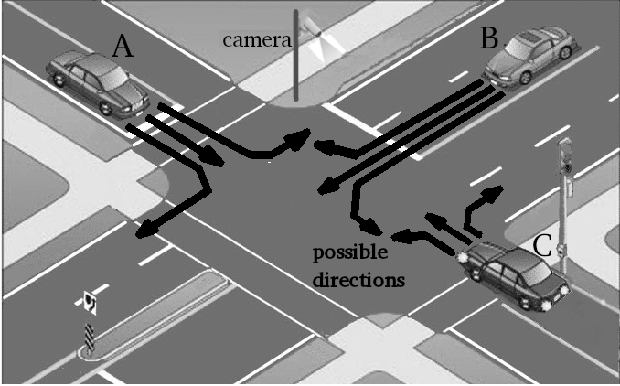
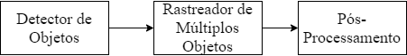
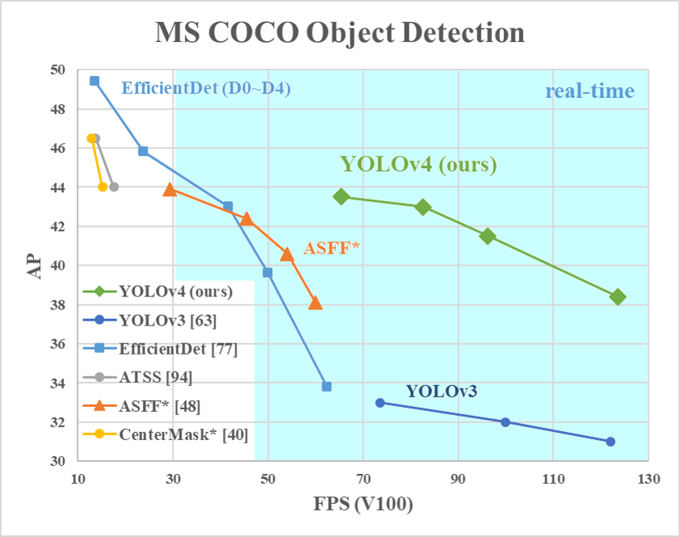
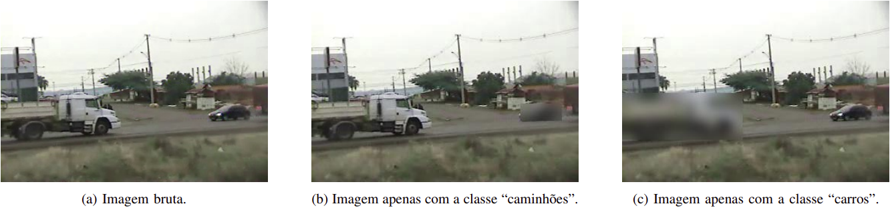
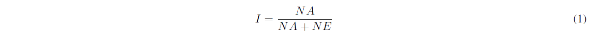
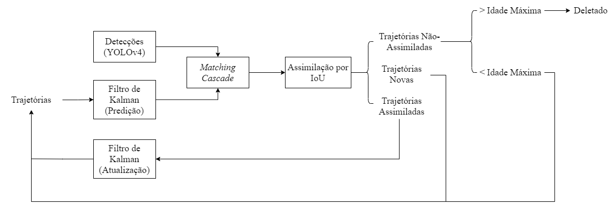
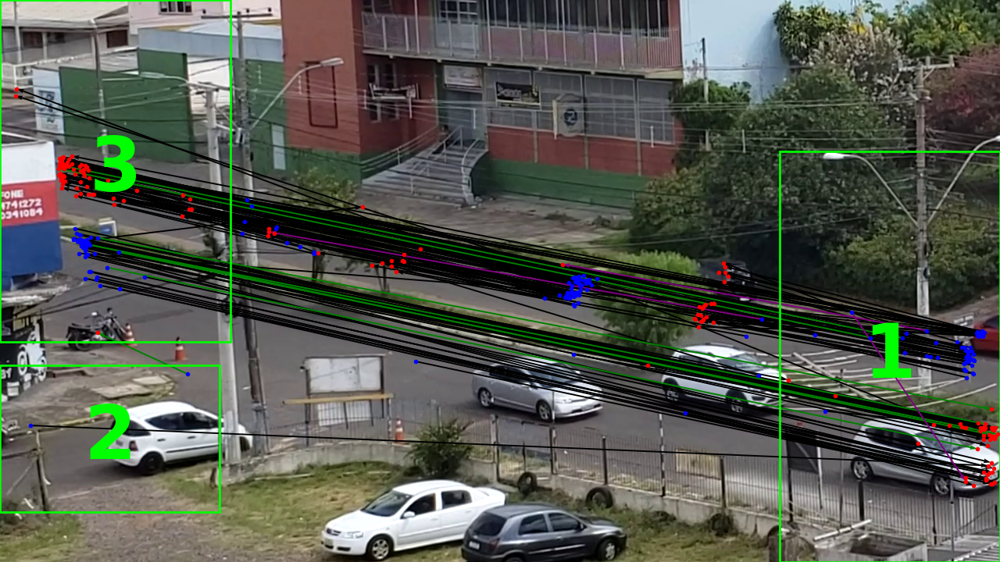

<h2>UNIVERSIDADE FEDERAL DO RIO GRANDE DO SUL</h2>
 
<h1>Sistema de Contagem, Classifica&ccedil;&atilde;o e Dire&ccedil;&atilde;o de Fluxo de Ve&iacute;culos em Estradas do RS</h1>
 

<h2>Introdu&ccedil;&atilde;o</h2>

As rodovias e estradas s&atilde;o o principal meio de interliga&ccedil;&atilde;o e transporte entre cidades ou regi&otilde;es em todo o Brasil, por se tratar de um pa&iacute;s em que o transporte terrestre por meio de carros e caminh&otilde;es &eacute; o mais utilizado. Por isso, o estudo e controle de tais meios &eacute; de devida import&acirc;ncia e caracteriza um problema que j&aacute; &eacute; visto na atualidade e perdurar&aacute; no futuro nos avan&ccedil;os tecnol&oacute;gicos para a automa&ccedil;&atilde;o de cidades, em um conceito tamb&eacute;m conhecido como cidades inteligentes.

Para o contexto do estado do Rio Grande do Sul, o Departamento Aut&ocirc;nomo de Estradas e Rodovias (DAER) &eacute; o &oacute;rg&atilde;o encarregado de gerir, monitorar, contabilizar e tomar decis&otilde;es acerca das estradas e rodovias estaduais. Tendo isso em mente, o monitoramento do fluxo, contagem e classifica&ccedil;&atilde;o de ve&iacute;culos para o planejamento de instala&ccedil;&atilde;o de sem&aacute;foros, redutores de velocidade, sinaliza&ccedil;&otilde;es e radares, por exemplo, &eacute; feito por este departamento. Normalmente, todo o trabalho ainda depende de execu&ccedil;&atilde;o manual, seja por monitoramento, supervis&atilde;o ou contagem, de horas de v&iacute;deos coletados em locais de interesse, geralmente em intersec&ccedil;&otilde;es. No entanto, com o avan&ccedil;o de estudos sobre vis&atilde;o computacional, atrav&eacute;s de ferramentas como redes neurais profundas (<em>deep neural networks</em>), h&aacute; a possibilidade de automa&ccedil;&atilde;o de tais atividades e poss&iacute;vel redu&ccedil;&atilde;o de custo para as entidades.

Por se tratar de um assunto em ascens&atilde;o, o estudo de tais casos apresenta diversas abordagens com a implementa&ccedil;&atilde;o de diferentes algoritmos e t&eacute;cnicas de vis&atilde;o computacional e processamento de imagens; entre as mais conhecidas tem-se o uso de fluxo &oacute;tico [1], opera&ccedil;&otilde;es morfol&oacute;gicas [13] e filtro de part&iacute;culas [5]. Todavia, avan&ccedil;os significativos para as tarefas foram alcan&ccedil;ados com a utiliza&ccedil;&atilde;o das <em>Deep Neural Networks</em> (DNNs) e, consequentemente, com as <em>Convolutional Neural Networks</em> (CNNs) que garantem uma maior precis&atilde;o e rapidez na detec&ccedil;&atilde;o e classifica&ccedil;&atilde;o de objetos [8, 4, 16, 14, 12].

<b>Figura 1: </b> Ilustra&ccedil;&atilde;o de uma intersec&ccedil;&atilde;o com 3 carros. Adaptado de [2].

A Figura 1 ilustra uma situa&ccedil;&atilde;o cl&aacute;ssica de interesse para o trabalho: uma encruzilhada com quatro entradas e quatro sa&iacute;das, no entanto, cada carro pode dirigir-se para tr&ecirc;s caminhos distintos; dessa forma, h&aacute;, no total, doze movimenta&ccedil;&otilde;es poss&iacute;veis para tal situa&ccedil;&atilde;o. O trabalho desenvolvido ao longo da Bolsa de Inicia&ccedil;&atilde;o Cient&iacute;fica (BIC) teve como objetivo fornecer uma ferramenta de automa&ccedil;&atilde;o, por meio de vis&atilde;o computacional, da an&aacute;lise do fluxo dos ve&iacute;culos, contagem e classifica&ccedil;&atilde;o destes em quatro classes distintas: carros, caminh&otilde;es, &ocirc;nibus e motocicletas. Para isso, o problema foi dividido em tr&ecirc;s blocos principais: detector de objetos, rastreador de m&uacute;ltiplos objetos e o p&oacute;s-processamento.

<b>Figura 2: </b> Blocos principais do trabalho.

<h2>Detector de Objetos</h2>

Entre as diversas possibilidades de CNNs para compor o bloco de detec&ccedil;&atilde;o de objetos, escolheu-se o <em>You Only Look Once</em> (YOLO) [15] j&aacute; que este apresenta r&aacute;pido processamento de imagens em tempo real e desempenho satisfat&oacute;rio para m&eacute;tricas como <em>average precision</em> (AP), que caracterizam a qualidade de detec&ccedil;&atilde;o, se comparado a outros modelos. A vers&atilde;o utilizada &eacute; a quarta, YOLOv4 [4], uma vez que esta possui um aprimoramento de 10% no <em>average precision</em> e 12% nos <em>frames per second</em>, ou seja, &eacute; melhor para detec&ccedil;&otilde;es em tempo real e h&aacute; maior precis&atilde;o se comparada &agrave; vers&atilde;o anterior, o YOLOv3. A Figura 3 demonstra compara&ccedil;&otilde;es entre diversos modelos de detectores.

<b>Figura 3: </b> Comparação dos detectores de objetos. Fonte: [4].

<h3><em>Dataset</em></h3>

O YOLO, assim como outros detectores, necessita de conjuntos de imagens com anota&ccedil;&otilde;es para extrair <em>features</em> e, com isso, &ldquo;aprender&rdquo; a reconhecer os objetos. De tal forma, &eacute; vital a coleta e cria&ccedil;&atilde;o de um banco de imagens com os objetos de interesse, em diferentes ambientes e condi&ccedil;&otilde;es, para se treinar um modelo robusto. Assim, optou-se por retreinar a base de dados COCO [11], a partir de pesos padr&atilde;o, com a introdu&ccedil;&atilde;o de novas imagens de c&acirc;meras fornecidas pelo DAER em 8 localidades diferentes no Rio Grande do Sul. Os v&iacute;deos, que possu&iacute;am baixa qualidade, foram agrupados e como havia grande quantidade de <em>frames</em> sem os ve&iacute;culos de interesse, optou-se pela utiliza&ccedil;&atilde;o de um filtro de movimento [7] feito para o projeto; desta forma, houve uma redu&ccedil;&atilde;o significativa de imagens a serem analisadas. O algoritmo do filtro separava os <em>frames</em> em que havia qualquer tipo de movimento e os colocava, em um diret&oacute;rio separado, como imagens avulsas; atrav&eacute;s dessas, foram feitas as anota&ccedil;&otilde;es individuais, para cada uma das imagens, dos objetos presentes de acordo com as quatro classes: carros, caminh&otilde;es, &ocirc;nibus e motocicletas. O <em>software</em> utilizado para fazer as anota&ccedil;&otilde;es e classifica&ccedil;&otilde;es dos objetos foi o <em>Visual Object Tagging Tool</em> (VoTT).

<b>Figura 4: </b> Exemplo de funcionamento do filtro de <em>blur</em>.

Com as imagens catalogadas &agrave; disposi&ccedil;&atilde;o, o passo seguinte foi a sele&ccedil;&atilde;o e cria&ccedil;&atilde;o do <em>dataset</em> para o treinamento: para um <em>dataset</em> balanceado, ou seja, cada uma das quatro classes deveria possuir o mesmo n&uacute;mero de objetos catalogados, foi utilizado um filtro de <em>blur</em> [7]. Este filtro, como pode ser visto na Figura 4, criava imagens independentes, com apenas uma classe, a partir da mesma figura fornecida, ou seja, se uma imagem possu&iacute;sse duas classes distintas, esta geraria outras duas imagens com as classes separadas. Por se ter uma quantidade elevada de imagens e a cataloga&ccedil;&atilde;o ter sido manual, optou-se por montar um <em>dataset</em> com 715 objetos para cada classe, sendo 500 (70%) para o treinamento e 215 (30%) para valida&ccedil;&atilde;o, como mostrado na Tabela 1.

<table class="tg">
	<caption><b>Tabela 1:</b><em> Dataset</em> balanceado.</caption>
<thead>
  <tr>
    <th class="tg-c3ow"></th>
    <th class="tg-c3ow">Objetos</th>
    <th class="tg-c3ow">Classe</th>
  </tr>
</thead>
<tbody>
  <tr>
    <td class="tg-c3ow" rowspan="4"> <strong>Imagens</strong></td>
    <td class="tg-c3ow">715</td>
    <td class="tg-c3ow">Carros</td>
  </tr>
  <tr>
    <td class="tg-c3ow">715</td>
    <td class="tg-c3ow">Caminhões</td>
  </tr>
  <tr>
    <td class="tg-c3ow">715</td>
    <td class="tg-c3ow">Ônibus</td>
  </tr>
  <tr>
    <td class="tg-c3ow">715</td>
    <td class="tg-c3ow">Motocicletas</td>
  </tr>
</tbody>
</table>

O treinamento do modelo foi feito na plataforma, em nuvem, <em>Google Colab</em> que permite a utiliza&ccedil;&atilde;o de processamento intenso de GPU e conex&atilde;o com os materiais necess&aacute;rios em uma conta do <em>Google Drive</em>, como o <em>dataset</em> e configura&ccedil;&otilde;es. O modelo treinado foi submetido &agrave; valida&ccedil;&atilde;o manual em 50 imagens, que n&atilde;o foram utilizadas no treinamento e n&atilde;o haviam sido passadas pelo filtro de detec&ccedil;&atilde;o de movimento, da ERS 030 por uma amostragem aleat&oacute;ria: um acerto &eacute; considerado como identificar um objeto com a classe correta e um erro &eacute; n&atilde;o identificar um objeto ou associ&aacute;-lo a uma classe errada. Todas as 50 imagens selecionadas foram validadas tanto no modelo retreinado com as imagens do DAER quanto o modelo padr&atilde;o COCO, sem o novo treinamento. A m&eacute;trica utilizada para caracterizar o desempenho dos modelos foi atrav&eacute;s do c&aacute;lculo do <em>INDEX</em> (<em>I</em>):

	

em que NA representa o n&uacute;mero de acertos e NE o n&uacute;mero de erros. Como evidenciado na Tabela 2, o <em>INDEX</em> para o modelo DAER ficou 1% inferior ao modelo padr&atilde;o COCO, ou seja, o seu desempenho foi levemente inferior e este n&atilde;o era um resultado esperado. A explica&ccedil;&atilde;o disso se deve justamente pelo <em>dataset</em> de treinamento ter sido montado a partir de um filtro de movimento em que o conjunto de imagens original foi passado e tamb&eacute;m pela baixa qualidade das imagens, que possu&iacute;am baixo constraste dos objetos em rela&ccedil;&atilde;o ao <em>background</em> e muitas vezes eram objetos pequenos.

<table class="tg">
	<caption><b>Tabela 2:</b><em> INDEX</em> para os dois modelos.</caption>
<thead>
  <tr>
    <th class="tg-baqh"></th>
    <th class="tg-baqh" colspan="2">Modelo</th>
  </tr>
</thead>
<tbody>
  <tr>
    <td class="tg-baqh" rowspan="2"><strong>INDEX</strong></td>
    <td class="tg-baqh">DAER</td>
    <td class="tg-baqh">COCO</td>
  </tr>
  <tr>
    <td class="tg-baqh">65%</td>
    <td class="tg-baqh">66%</td>
  </tr>
</tbody>
</table>

Para tentar melhorar esses resultados, foram adicionadas novas imagens de alta resolu&ccedil;&atilde;o, provenientes de 8 v&iacute;deos da plataforma <em>YouTube</em> (que eram de estradas ou rodovias similares &agrave; aplica&ccedil;&atilde;o), do <em>Google Open Images Dataset</em> (15000 imagens de carros e 5000 imagens para cada uma das classes caminh&otilde;es, &ocirc;nibus e motocicletas) e de v&iacute;deos da rua Rubem Berta (RS), no <em>dataset</em> j&aacute; utilizado anteriormente. Assim, foi criado um novo conjunto de imagens, nomeado de <em>expanded dataset</em>, com quantidades de objetos desbalanceada para treinar um novo modelo.

<table class="tg">
	<caption><b>Tabela 3:</b><em> Expanded dataset</em> para o treinamento.</caption>
<thead>
  <tr>
    <th class="tg-baqh">Imagens</th>
    <th class="tg-baqh">Objetos</th>
    <th class="tg-baqh">Classe</th>
  </tr>
</thead>
<tbody>
  <tr>
    <td class="tg-baqh" rowspan="4">24268</td>
    <td class="tg-baqh">36239</td>
    <td class="tg-baqh">Carros</td>
  </tr>
  <tr>
    <td class="tg-baqh">6999</td>
    <td class="tg-baqh">Caminhões</td>
  </tr>
  <tr>
    <td class="tg-baqh">6121</td>
    <td class="tg-baqh">Ônibus</td>
  </tr>
  <tr>
    <td class="tg-baqh">7562</td>
    <td class="tg-baqh">Motocicletas</td>
  </tr>
</tbody>
</table>

<h3>Resultados</h3>

Este novo modelo foi testado em 50 <em>frames</em> retirados de um novo v&iacute;deo em alta resolu&ccedil;&atilde;o, intitulado Rubem Berta, e os resultados foram mais promissores, como pode ser visto na Tabela 4. A introdu&ccedil;&atilde;o de novas imagens em alta resolu&ccedil;&atilde;o e similares &agrave; aplica&ccedil;&atilde;o, que s&atilde;o estradas e rodovias, realmente introduziram um incremento de 6% em rela&ccedil;&atilde;o ao COCO original e compuseram o modelo final, para o bloco de detec&ccedil;&atilde;o de objetos, na aplica&ccedil;&atilde;o do trabalho.

<table>
	<caption><b>Tabela 4:</b><em> INDEX</em> dos dois modelos para imagens do Rubem Berta.</caption>
<thead>
  <tr>
    <th class="tg-0lax"> </th>
    <th class="tg-baqh" colspan="2">Modelo</th>
  </tr>
</thead>
<tbody>
  <tr>
    <td class="tg-0lax"> </td>
    <td class="tg-0lax">DAER (<i>expanded dataset</i>)</td>
    <td class="tg-0lax">COCO</td>
  </tr>
  <tr>
    <td class="tg-0lax"><strong>INDEX</strong></td>
    <td class="tg-0lax">78%</td>
    <td class="tg-0lax">72%</td>
  </tr>
</tbody>
</table>

<h2>Rastreador de M&uacute;ltiplos Objetos</h2>

O bloco de rastreamento de m&uacute;ltiplos objetos, necess&aacute;rio para fazer a correla&ccedil;&atilde;o de diversos objetos entre <em>frames</em> subsequentes de v&iacute;deos, contou com a implementa&ccedil;&atilde;o do algoritmo DeepSORT [17]. Esse &eacute; o sucessor do <em>Simple Online RealTime Tracking</em> (SORT) [3], que utiliza a implementa&ccedil;&atilde;o de um filtro de Kalman e do algoritmo H&uacute;ngaro [10], e aperfei&ccedil;oou o modelo ao garantir um melhor rastreamento dos objetos com a redu&ccedil;&atilde;o do n&uacute;mero de troca de identidades, em cerca de 45%, e robustez contra oclus&otilde;es por causa da possibilidade de reidentidica&ccedil;&atilde;o destes.

<b>Figura 5: </b> Fluxograma simplificado do funcionamento do DeepSORT.

A partir da Figura 5 &eacute; poss&iacute;vel compreender, de maneira mais simplificada, o funcionamento do DeepSORT. As detec&ccedil;&otilde;es feitas pelo bloco do YOLOv4 s&atilde;o comparadas e correlacionadas com rastreamentos j&aacute; existentes de outros objetos previamente identificados, a partir de t&eacute;cnicas como semelhan&ccedil;a de cossenos e dist&acirc;ncia de Mahalanobis, no bloco de <em>Matching Cascade</em> e, em seguida, passam pelo bloco de IoU (<em>Intersection Over Union</em>). Neste bloco, h&aacute; a defini&ccedil;&atilde;o da qualidade da detec&ccedil;&atilde;o dos objetos com as <em>bounding boxes</em>, propostas pelo sistema, por meio do c&aacute;lculo da intersec&ccedil;&atilde;o sobre a uni&atilde;o das regi&otilde;es previstas.

<b>Figura 6: </b> <em>Intersection Over Union</em> (IoU). Fonte: Rosebrock, 2016.

Em seguida, h&aacute; a valida&ccedil;&atilde;o das trajet&oacute;rias com os objetos identificados e atualiza&ccedil;&atilde;o dos par&acirc;metros de erro do filtro de Kalman. Para as trajet&oacute;rias n&atilde;o-assimiladas, espera-se uma quantidade m&aacute;xima de <em>frames</em> (hiperpar&acirc;metro <em>max_age</em>) na qual um objeto pode permanecer sem ser associado &agrave; outro j&aacute; existente ou reidentificado; caso a quantidade seja ultrapassada, o objeto e trajet&oacute;ria s&atilde;o descartados. Por fim, as trajet&oacute;rias v&aacute;lidas e associadas aos objetos s&atilde;o introduzidas no filtro de Kalman para serem feitas as predi&ccedil;&otilde;es de novas regi&otilde;es para as <em>bounding boxes</em>, ou seja, um c&aacute;lculo para as poss&iacute;veis posi&ccedil;&otilde;es futuras dos objetos.

O DeepSORT &eacute; pr&eacute;-treinado, para a fase de <em>tracking</em>, com uma base de dados p&uacute;blica com &ecirc;nfase na identifica&ccedil;&atilde;o de pessoas, o MARS (<em>Motion Analysis and Re-identification Set</em>) [18]. No entanto, como a aplica&ccedil;&atilde;o deste trabalho tem como objetivo a identifica&ccedil;&atilde;o de ve&iacute;culos, a rede foi retreinada com a base de dados VRIC (<em>Vehicle Re-Identification in Context</em>) [9], que tem como &ecirc;nfase diversas imagens de ve&iacute;culos em <em>frames</em> subsequentes.

<h2>P&oacute;s-Processamento</h2>

O &uacute;ltimo bloco que comp&otilde;e o sistema &eacute; o de p&oacute;s-processamento, que inclui a coleta dos dados provenientes do rastreador de m&uacute;ltiplos objetos e faz a contagem e visualiza&ccedil;&atilde;o das trajet&oacute;rias dos ve&iacute;culos em cenas. Neste caso, houve a cria&ccedil;&atilde;o e implementa&ccedil;&atilde;o de algoritmos que verificavam inconsist&ecirc;ncias nas rotas e realizavam a contagem, al&eacute;m de uma interface visual para a sele&ccedil;&atilde;o das regi&otilde;es de interesse para as entradas e sa&iacute;das da cena escolhida.

O estudo de caso para a contagem foi feito atrav&eacute;s de um v&iacute;deo in&eacute;dito, tamb&eacute;m da rua Rubem Berta, com um tempo de 5 minutos e 36 segundos, como evidenciado em um <em>frame</em> na Figura 7. Tal v&iacute;deo foi analisado e feita a contagem manual dos ve&iacute;culos pelos realizadores do projeto, considerada como os valores reais, e comparou-se com os resultados obtidos a partir dos modelos treinados do DeepSORT nas bases MARS e VRIC, como visto nas Tabelas 5 e 6.

<b>Figura 7: </b> Regi&otilde;es selecionadas para entradas e sa&iacute;das. Fonte: [6].

<table>
	<caption><b>Tabela 5:</b> Contagens para o modelo com MARS. Fonte: [6].</caption>
	<thead>
  <tr>
    <th class="tg-baqh"> </th>
    <th class="tg-baqh" colspan="2">Carros</th>
    <th class="tg-baqh" colspan="2">Motocicletas</th>
    <th class="tg-baqh" colspan="2">Caminhões</th>
    <th class="tg-baqh" colspan="2">Ônibus</th>
  </tr>
</thead>
<tbody>
  <tr>
    <td class="tg-baqh"> <strong>Entrada</strong></td>
    <td class="tg-baqh">Real</td>
    <td class="tg-baqh">Sistema</td>
    <td class="tg-baqh">Real</td>
    <td class="tg-baqh">Sistema</td>
    <td class="tg-baqh">Real</td>
    <td class="tg-baqh">Sistema</td>
    <td class="tg-baqh">Real</td>
    <td class="tg-baqh">Sistema</td>
  </tr>
  <tr>
    <td class="tg-baqh">1</td>
    <td class="tg-baqh">38</td>
    <td class="tg-baqh">48</td>
    <td class="tg-baqh">4</td>
    <td class="tg-baqh">5</td>
    <td class="tg-baqh">1</td>
    <td class="tg-baqh">0</td>
    <td class="tg-baqh">0</td>
    <td class="tg-baqh">0</td>
  </tr>
  <tr>
    <td class="tg-baqh">2</td>
    <td class="tg-baqh">0</td>
    <td class="tg-baqh">1</td>
    <td class="tg-baqh">0</td>
    <td class="tg-baqh">1</td>
    <td class="tg-baqh">0</td>
    <td class="tg-baqh">0</td>
    <td class="tg-baqh">0</td>
    <td class="tg-baqh">0</td>
  </tr>
  <tr>
    <td class="tg-baqh">3</td>
    <td class="tg-baqh">52</td>
    <td class="tg-baqh">55</td>
    <td class="tg-baqh">2</td>
    <td class="tg-baqh">1</td>
    <td class="tg-baqh">0</td>
    <td class="tg-baqh">3</td>
    <td class="tg-baqh">0</td>
    <td class="tg-baqh">0</td>
  </tr>
  <tr>
    <td class="tg-baqh"><strong>Saída</strong></td>
    <td class="tg-baqh">Real</td>
    <td class="tg-baqh">Sistema</td>
    <td class="tg-baqh">Real</td>
    <td class="tg-baqh">Sistema</td>
    <td class="tg-baqh">Real</td>
    <td class="tg-baqh">Sistema</td>
    <td class="tg-baqh">Real</td>
    <td class="tg-baqh">Sistema</td>
  </tr>
  <tr>
    <td class="tg-baqh">1</td>
    <td class="tg-baqh">52</td>
    <td class="tg-baqh">83</td>
    <td class="tg-baqh">2</td>
    <td class="tg-baqh">2</td>
    <td class="tg-baqh">0</td>
    <td class="tg-baqh">2</td>
    <td class="tg-baqh">0</td>
    <td class="tg-baqh">0</td>
  </tr>
  <tr>
    <td class="tg-baqh">2</td>
    <td class="tg-baqh">0</td>
    <td class="tg-baqh">0</td>
    <td class="tg-baqh">0</td>
    <td class="tg-baqh">0</td>
    <td class="tg-baqh">0</td>
    <td class="tg-baqh">0</td>
    <td class="tg-baqh">0</td>
    <td class="tg-baqh">0</td>
  </tr>
  <tr>
    <td class="tg-baqh">3</td>
    <td class="tg-baqh">38</td>
    <td class="tg-baqh">45</td>
    <td class="tg-baqh">4</td>
    <td class="tg-baqh">5</td>
    <td class="tg-baqh">1</td>
    <td class="tg-baqh">0</td>
    <td class="tg-baqh">0</td>
    <td class="tg-baqh">0</td>
  </tr>
</tbody>
</table>

<table class="tg">
	<caption><b>Tabela 6:</b> Contagens para o modelo com VRIC. Fonte: [6].</caption>
<thead>
  <tr>
    <th class="tg-c3ow"></th>
    <th class="tg-c3ow" colspan="2">Carros</th>
    <th class="tg-c3ow" colspan="2">Motocicletas</th>
    <th class="tg-c3ow" colspan="2">Caminhões</th>
    <th class="tg-c3ow" colspan="2">Ônibus</th>
  </tr>
</thead>
<tbody>
  <tr>
    <td class="tg-c3ow"><strong>Entrada</strong></td>
    <td class="tg-c3ow">Real</td>
    <td class="tg-c3ow">Sistema</td>
    <td class="tg-c3ow">Real</td>
    <td class="tg-c3ow">Sistema</td>
    <td class="tg-c3ow">Real</td>
    <td class="tg-c3ow">Sistema</td>
    <td class="tg-c3ow">Real</td>
    <td class="tg-c3ow">Sistema</td>
  </tr>
  <tr>
    <td class="tg-c3ow">1</td>
    <td class="tg-c3ow">38</td>
    <td class="tg-c3ow">41</td>
    <td class="tg-c3ow">4</td>
    <td class="tg-c3ow">5</td>
    <td class="tg-c3ow">1</td>
    <td class="tg-c3ow">1</td>
    <td class="tg-c3ow">0</td>
    <td class="tg-c3ow">0</td>
  </tr>
  <tr>
    <td class="tg-c3ow">2</td>
    <td class="tg-c3ow">0</td>
    <td class="tg-c3ow">1</td>
    <td class="tg-c3ow">0</td>
    <td class="tg-c3ow">1</td>
    <td class="tg-c3ow">0</td>
    <td class="tg-c3ow">0</td>
    <td class="tg-c3ow">0</td>
    <td class="tg-c3ow">0</td>
  </tr>
  <tr>
    <td class="tg-c3ow">3</td>
    <td class="tg-c3ow">52</td>
    <td class="tg-c3ow">52</td>
    <td class="tg-c3ow">2</td>
    <td class="tg-c3ow">2</td>
    <td class="tg-c3ow">0</td>
    <td class="tg-c3ow">2</td>
    <td class="tg-c3ow">0</td>
    <td class="tg-c3ow">0</td>
  </tr>
  <tr>
    <td class="tg-c3ow"><strong>Saída</strong></td>
    <td class="tg-c3ow">Real</td>
    <td class="tg-c3ow">Sistema</td>
    <td class="tg-c3ow">Real</td>
    <td class="tg-c3ow">Sistema</td>
    <td class="tg-c3ow">Real</td>
    <td class="tg-c3ow">Sistema</td>
    <td class="tg-c3ow">Real</td>
    <td class="tg-c3ow">Sistema</td>
  </tr>
  <tr>
    <td class="tg-c3ow">1</td>
    <td class="tg-c3ow">52</td>
    <td class="tg-c3ow">74</td>
    <td class="tg-c3ow">2</td>
    <td class="tg-c3ow">3</td>
    <td class="tg-c3ow">0</td>
    <td class="tg-c3ow">0</td>
    <td class="tg-c3ow">0</td>
    <td class="tg-c3ow">0</td>
  </tr>
  <tr>
    <td class="tg-c3ow">2</td>
    <td class="tg-c3ow">0</td>
    <td class="tg-c3ow">0</td>
    <td class="tg-c3ow">0</td>
    <td class="tg-c3ow">0</td>
    <td class="tg-c3ow">0</td>
    <td class="tg-c3ow">0</td>
    <td class="tg-c3ow">0</td>
    <td class="tg-c3ow">0</td>
  </tr>
  <tr>
    <td class="tg-c3ow">3</td>
    <td class="tg-c3ow">38</td>
    <td class="tg-c3ow">37</td>
    <td class="tg-c3ow">4</td>
    <td class="tg-c3ow">5</td>
    <td class="tg-c3ow">1</td>
    <td class="tg-c3ow">1</td>
    <td class="tg-c3ow">0</td>
    <td class="tg-c3ow">0</td>
  </tr>
</tbody>
</table>

&Eacute; percept&iacute;vel que o modelo do DeepSORT retreinado com a base de dados VRIC obteve uma sobre contagem de ve&iacute;culos inferior ao modelo padr&atilde;o com MARS, ou seja, o sistema se assemelhou mais &agrave; contagem manual e justificou tal retreino. Apesar desses serem resultados promissores, j&aacute; que o sistema atingiu seu objetivo de contar, classificar e mostrar as rotas dos ve&iacute;culos, ainda h&aacute; um grande espa&ccedil;o para aprimoramento e refinamento de cada um dos blocos indicados para a cria&ccedil;&atilde;o de um modelo robusto e que gere poucos erros para qualquer ambiente ao qual for empregado.

<h2>Contribui&ccedil;&atilde;o Cient&iacute;fica</h2>

O projeto desenvolvido fez parte de um artigo cient&iacute;fico enviado para o INSCIT 2021 - <em>5<em>t</em><em>h</em> International Symposium on Instrumentation System, Circuits and Transducers</em>, que est&aacute; em estado de an&aacute;lise, e foi tema do trabalho de conclus&atilde;o de curso de Engenharia El&eacute;trica do aluno Luiz Carlos Gatelli [6].

<h2>Refer&ecirc;ncias</h2>

[1]  A. Abdagic, O. Tanovic, A. Aksamovic, and S. Huseinbegovic. Counting traffic using optical flow algorithm on videofootage of a complex crossroad.  InProceedings ELMAR-2010, pages 41–45, Sep. 2010.

[2]  Georges  Aoude,  Vishnu  Desaraju,  Lauren  Stephens,  and  Jonathan  How.Behavior  classification  algorithms  atintersections.  09 2011.

[3]  Alex  Bewley,  Zongyuan  Ge,  Lionel  Ott,  Fabio  Ramos,  and  Ben  Upcroft.   Simple  online  and  realtime  tracking.   In2016 IEEE international conference on image processing (ICIP), pages 3464–3468. IEEE, 2016.

[4]  Alexey  Bochkovskiy,  Chien-Yao  Wang,  and  Hong-Yuan  Mark  Liao.  Yolov4:  Optimal  speed  and  accuracy  of  objectdetection, 2020.

[5]  Christiano Bouvi ́e, Jacob Scharcanski, Pablo Barcellos, and Fabiano Lopes Escouto.  Tracking and counting vehiclesin traffic video sequences using particle filtering.  pages 812–815. IEEE, 2013.

[6]  Luiz Carlos Gatelli.  Sistema de monitoramento, contagem e classificaç&atilde;o de fluxo de ve ́ıculos usando redes neuraisconvolucionais, 2021.

[7]  Gabriel  Gosmann,  Felipe  Albrecht  Fitarelli,  and  Guilherme  Huth.Daer-project. https://github.com/Gosmann/DAER-project, 2021.

[8]  K.  He,  X.  Zhang,  S.  Ren,  and  J.  Sun.  Deep  residual  learning  for  image  recognition.  In2016  IEEE  Conference  onComputer Vision and Pattern Recognition (CVPR), pages 770–778, 2016.

[9]  Aytac Kanaci, Xiatian Zhu, and Shaogang Gong.  Vehicle re-identification in context.  InPattern Recognition - 40thGerman Conference, GCPR 2018, Stuttgart, Germany, September 10-12, 2018, Proceedings, 2018.

[10]  H. W. Kuhn.  The hungarian method for the assignment problem.Naval Research Logistics Quarterly, 2(1-2):83–97,1955.

[11]  Tsung-Yi  Lin,  Michael  Maire,  Serge  Belongie,  Lubomir  Bourdev,  Ross  Girshick,  James  Hays,  Pietro  Perona,  DevaRamanan, C. Lawrence Zitnick, and Piotr Doll ́ar.  Microsoft coco: Common objects in context, 2015.

[12]  Wei Liu, Dragomir Anguelov, Dumitru Erhan, Christian Szegedy, Scott Reed, Cheng-Yang Fu, and Alexander C. Berg.Ssd:  Single  shot  multibox  detector.   In  Bastian  Leibe,  Jiri  Matas,  Nicu  Sebe,  and  Max  Welling,  editors,ComputerVision – ECCV 2016, pages 21–37, Cham, 2016. Springer International Publishing.

[13]  H.  T.  Pandu  Ranga,  M.  Ravi  kiran,  S.  Raja  shekar,  and  S.  K.  Naveen  kumar.   Vehicle  detection  and  classificationbased on morphological technique.  InInternational Conference on Signal and Image Processing, 2010.

[14]  J.  Redmon  and  A.  Farhadi.   Yolo9000:  Better,  faster,  stronger.   In 2017  IEEE  Conference  on  Computer  Vision  andPattern Recognition (CVPR), pages 6517–6525, 2017.

[15]  Joseph  Redmon,  Santosh  Divvala,  Ross  Girshick,  and  Ali  Farhadi.   You  only  look  once:  Unified,  real-time  objectdetection.  InProceedings of the IEEE Conference on Computer Vision and Pattern Recognition (CVPR), June 2016.

[16]  Shaoqing Ren, Kaiming He, Ross Girshick, and Jian Sun. Faster r-cnn: Towards real-time object detection with regionproposal networks.

[17]  N. Wojke, A. Bewley, and D. Paulus.  Simple online and realtime tracking with a deep association metric.  In 2017IEEE International Conference on Image Processing (ICIP), pages 3645–3649, 2017.

[18]  Liang Zheng, Zhi Bie, Yifan Sun, Jingdong Wang, Chi Su, Shengjin Wang, and Qi Tian.  Mars: A video benchmarkfor large-scale person re-identification.  InEuropean Conference on Computer Vision, pages 868–884. Springer, 2016.

